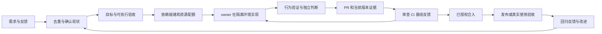

# 如何让 AI / agent 更快交付工业级需求

2026-09-28 更新。基于 Lauren 官方 pstack、最新访谈完整英文自动字幕，Stripe/Ramp/Spotify/Shopify/Uber 工程案例，Cursor/OpenAI/Anthropic/StrongDM 架构资料，以及实验和论文。用户工作流对照沿用 **8 月 25 日至 9 月 24 日** 的已存档会话研究；本轮未重新扫描后四天 session。

## 先说结论

后续补充：[Pi 实战与 Factory Missions 两视频](../supplement-videos/analysis.md)。Factory 的强耦合任务串行实现、内部只读并行，为本报告的并发建议补充了一个应做对照的具体方案；Pi 的公开配置则进一步说明流程描述与真实可运行保障需要分别验证。

**下一步最值得优化的是“每项需求从开始到真正交付的连续性”。** 让 agent 能发现、实现、验证和修正问题，并自动处理已授权的等待与恢复；人集中处理产品方向、关键取舍和异常。

五个优先判断：

1. **先构造可以自主完成的需求，再扩大并发。** 清楚的目标、行为参照、可启动环境、独立验收，让长时自治有依据。复杂需求先做一条真实纵向路径，提前暴露默认装配和集成问题。
2. **保留一个持续负责的 owner。** 实现、CI、review 反馈、基线变化和交付状态回到同一个需求上下文。独立研究和验证可以并行；减少反复把任务交回人类再派出。
3. **并发量由验收和合入能力共同决定。** 隔离工作区只解决一部分共享写问题。端口、数据库、模型额度、CI、审查队列都可能限流；滚动补任务，优先完成已开始的需求。
4. **把可确定的流程写成可检查的操作。** repo/target/base/head、claim、状态核对、等待唤醒、检查结果和交付核销应复用既有工具。语义判断交给 agent，避免让模型重复记住机械步骤。
5. **衡量完成需求的净收益。** 更多高质量 PR 是结果之一；同时记录验收、人工分钟、周期、返工、缺陷和成本。公开案例不足以承诺固定倍数的提速。

这些是多源综合推论；没有一篇资料证明一个框架适合所有团队。具体建议和优先级见第 5–7 节。

## 1. Lauren 的方法，之前漏了什么

上次抓到的核心仍成立：让一个 agent 能深入理解、操作和验证系统，再扩大并发。本轮最重要的补充是官方 pstack 已把它写成**从需求到合入、并可接续的执行协议**。

| 新补齐的机制 | 实际含义 | 你可借鉴的部分 |
|---|---|---|
| `orchestrate` | 持续协调、滚动 ready set、批量处理完成事件、从第一项起持续落地 | 避免一批任务等最慢者；整合提前；缩短协调中断 |
| `autopilot-full` | 每 PR 一个 owner，跟到 CI、review、合入；root 独立裁决 | owner 不在“代码写完”时退出；复用原上下文处理反馈 |
| `autopilot-stack` | 先自主构建验证 stack，再由人审查合入 | 自主执行与自动合并授权可以分开 |
| `babysit` / `shipping` | merge-ready 与 merged 分开；只合连续已验证前缀 | 完成状态精确；对新 SHA 刷新对应证据 |
| verify skill + Feature Map | 启动、驱动真实入口、观察动作/状态/副作用、隔离、保留证据 | 把你现在亲手发现的行为问题变成 agent 能执行的验收 |
| `eval` 与 PR #419 | 对技能做受限 A/B，删去没有增益的指令 | 给新增流程和模型角色设置保留条件 |
| PR #422 | 修正 owner/babysitter、append-only、模型配置等规则冲突 | 减少重复规则与模糊职责；同一事实只保留明确权威 |

依据：[官方源码固定版本](https://github.com/cursor/plugins/tree/ecc249f1e306fc64ddf83c7bed16cacf7c2239db/pstack)、[指令消融 PR #419](https://github.com/cursor/plugins/pull/419)、[冲突修复 PR #422](https://github.com/cursor/plugins/pull/422)。本地完整 [遗漏矩阵](../intermediate/lauren/findings.md) 含路径、限制和新增/旧遗漏区分。

源码版本 0.15.5，有 23 个 playbooks；pstack 自身最近提交为 9 月 23 日，因此多数属于此前研究遗漏。它也含很重的模板，例如 multi-phase-plan 的十条 live lane；不能据此要求每个需求十路验证。`orch` CLI 只做状态记账，不自动派发和唤醒。

**真正的新材料**是 9 月 27 日 Peter Yang 访谈。匿名字幕获取遇到 429 后，已通过公开 YouTube 页面导出完整英文自动字幕。新增四点：

- **需求路由分层**：Matcha 拆分并监督工程 bot，后者启动云编码 agents；按任务调模型/推理强度。[25:22–27:57](https://www.youtube.com/watch?v=xZ5TEaleUdg&t=1522s)
- **反馈接入交付**：社交 bot 聚合相同问题，工程负责人直接取上下文、提出修复设计，减少人复制粘贴。[32:46–35:00](https://www.youtube.com/watch?v=xZ5TEaleUdg&t=1966s)
- **自动化也需维护**：从历史对话找反复错误、上下文过杂和过密唤醒，调整 skill、bot 分工与 routine。[20:01–21:25](https://www.youtube.com/watch?v=xZ5TEaleUdg&t=1201s)
- **逐步授权**：先观察和纠偏，再沉淀 skill；能稳定一次完成后，才转成持续自动运行。[39:34–42:07](https://www.youtube.com/watch?v=xZ5TEaleUdg&t=2374s)

字幕中的专名有识别错误，未人工逐字听校；以上是口述证据，没有把画面或收益当作已验证。她自述部分 PR 先合入再查看，前提提到 agent-friendly 代码库，不能据此替任意仓库设自动合并。详见 [带时间戳笔记](../intermediate/lauren/interview-2026-09-27-notes.md) 与 [原始字幕](../raw/lauren/interview-2026-09-27/transcript/youtube-browser-export.txt)。

Lauren 的 2,000/2,500 PR 仍是个人自述；没有完整 PR 审计、复杂度归一、净人工时间或线上缺陷数据。其机制比这个数字更有可迁移价值。

## 2. 工业实践补充了哪些关键能力

| 体系 | 对自动交付最有用的机制 | 已公开效果的口径与限制 |
|---|---|---|
| [Stripe Minions](https://stripe.dev/blog/minions-stripes-one-shot-end-to-end-coding-agents-part-2) | 预热 devbox；确定性 Blueprint 包围 agent；本地快反馈；CI 修复有轮次预算 | 自述每周 >1,300 个由 agent 编码、**经人 review** 的 merged PR。one-shot 内部仍可迭代 |
| [Ramp Inspect](https://builders.ramp.com/post/why-we-built-our-background-agent) | 镜像/缓存预热；同步基线前只读；完整应用和浏览器；多个入口共享会话 | 自述约 30% merged PR 来自 Inspect，是采用份额，不是任务成功率或无限容量证明 |
| [Spotify Honk](https://engineering.atspotify.com/2026/4/background-coding-agents-dataset-migrations-honk-part-4) | 在成熟批量迁移平台接入 coding agent；明确 skip 条件；标准 verify | 缺自动测试的迁移仍卡人工验收；较早的约一半自动 PR 不能全算 LLM |
| [Shopify Helix](https://shopify.engineering/helix) | 参照实现、小 checkpoint、行为 CLI、视觉比较、隔离 review；独立 screen 并行 | 2026-09-21 案例，没有可复算交付吞吐对照；不能套用别的迁移项目数字 |
| [Shopify River](https://shopify.engineering/river-vulnerability-remediation) | 动作前核对实时状态；CI 对应当前 SHA；合并后核对默认分支与工单 | 11 天 backlog 降约 70%，含过时/别处已修；不等于 70% 新问题被 agent 修复 |
| [Shopify Dispatch](https://shopify.engineering/building-an-agentic-harness-that-outlasts-the-model) | 研究按领域并行；共享端口/数据库验证串行；先复现再修复 | findings 不是 PR，也不等于已修缺陷；说明资源约束必须进入调度 |
| [Uber uReview](https://www.uber.com/us/en/blog/ureview/) | 生成发现后评分、去重、过滤低价值评论；按反馈校准 | 有用率是评论口径；节省工时是估算。原文 diffs 周/月数矛盾，本报告不用该数字 |
| [OpenAI harness / Symphony](https://openai.com/index/open-source-codex-orchestration-symphony/) | issue 驱动连续执行；工作区可运行、可观测；处理依赖、CI 和反馈 | PR 增幅是团队前后自报。规范 worker success 可以只到 Human Review |
| [Cursor 后续实验](https://cursor.com/blog/self-driving-codebases) | 递归规划、隔离 worker、滚动 handoff；移除了 judge 和集中 integrator 两个角色 | 内部浏览器实验，容许工作分支短暂错误；峰值 commits/hour 不是可交付 PR/hour |
| [Anthropic 长任务](https://www.anthropic.com/engineering/harness-design-long-running-apps) | 独立 evaluator 用真实交互并校准；模型升级后逐项删除旧框架结构 | 新旧样例的时间/费用/范围不同，不能宣传为等成本提速 |
| [StrongDM](https://factory.strongdm.ai/) | 需求场景独立于实现；外部服务行为替身对 live 校准；最终行为验收 | “不写/不审”和 token 预算是团队宣言，未证明普适最优 |

完整事实、数字边界和原文定位见 [企业案例](../intermediate/industry/findings.md)、[架构分析](../intermediate/architecture/findings.md)。

它们覆盖四类不同问题：**成熟仓库的局部需求、同类批量迁移、有明确参照的迁移/重建、开放式产品开发**。前三类更容易建立机械验收。不能把批量依赖升级的成功率拿来预测新产品需求。

## 3. 一条工业级交付链应该解决什么

下图是本次综合建议，非某家系统的原样复制：

### 入口：把需求加工到可执行

对明确 bug，先取得可重复失败；对功能需求，先确定用户可观察结果、关键反例和不做什么；对不确定交互，先给出原型供人做决定。agent 先从代码、文档、历史和真实系统查证，不能把可查的问题全部变成人类问卷。

同一个需求持续关联其决定、实际仓库/base/head、依赖和产物。PR 可以有多个，但需求是否完成有统一边界。无效、重复、已解决的请求尽早结束，避免制造无价值 PR。Benny 的分诊和 River 的实时核对支持这一路径；它们并没有证明模糊业务意图可完全无人决定。

### 执行：一个 owner 持续负责，确定性操作承接机械状态

owner 负责把需求推进到约定的完成边界，独立工作者提供模块或判断。对于 Git 身份、claim、等待和重试、事件去重、收集检查结果，优先调用现有可靠操作。连续 owner 指需求责任与权威状态的连续，允许更换 session/agent；接续前核对旧执行已停止或失去写权限，复用现有 claim/fence/recovery 避免双写。需求身份和产物不能因 session 结束而消失。

这并不要求新建 durable 调度数据库。[Symphony 固定规范](https://github.com/openai/symphony/blob/8001b52e3062495a16e520e4ceaf8f9de868c4d0/SPEC.md) 可以从 tracker/filesystem 重建；[Anthropic Managed Agents](https://www.anthropic.com/engineering/managed-agents) 用持久事件与可替换运行环境分离。重点是故障后能核对事实并继续，不应预先规定必须哪种存储架构。

### 验收：不同证据证明不同事情

- 类型/lint：结构和部分静态约束。
- 单元/集成测试：指定输入和边界下的行为。
- 实际入口：UI/CLI/API 的真实装配、状态和副作用。
- 独立 review/场景：实现者可能共同遗漏的要求和反例。
- 合并后/发布验证：实际被交付的版本与环境。

按任务选必要层次，不能用一层冒充另一层。受保护的最终验收可减少 agent 自改标准而通过；开发阶段仍需足够可见的失败反馈。独立 reviewer 也会犯错，应以已有真实 bug 和误报样例校准。

证据需要对应 `需求/场景 + base/head + 命令或动作 + 环境 + 结果`。改了代码、基线、依赖或验证环境，判断哪些证据失效并重跑受影响检查；相同版本已通过的检查不重复跑。

### 交付：结束在明确的边界

建议复用既有 receipt 区分：实现、局部检查、真实验收、push、PR、merge、发布/线上验证。等待 review/CI 应能恢复；外部事实已变化就重新核对。只有明确得到合并/部署授权的工作才能到相应环节。

本用户的 **docs-only MR 规则继续适用**：必要文档检查、commit/push 和 MR 创建/更新完成即交付，不主动查询或等待 CI。不能为统一流水线而加回用户已取消的等待。

## 4. 如何增加真正有效的并发

### 先区分三种工作

| 类型 | 组织方式 | 主要风险 |
|---|---|---|
| 多个独立需求 | 每项一个 owner，各自执行与验证 | 共用环境/CI/人审造成队列增长 |
| 单需求中的独立切片 | 先建立接口与最薄纵向路径，再并行；持续组合验收 | 下游拿旧基线，局部都通过但系统不通 |
| 同一问题的竞赛或独立审查 | 同预算下事先规定选优/合并/裁决规则 | 重复工作、噪声、整合成本大于收益 |

多 agent 论文主要研究后两类，不能直接推导第一类的最佳并发数。[Scaling Agent Systems v3](https://arxiv.org/html/2512.08296v3) 的代码子集只有 20 题且区间宽，不支持“多 agent 一律更强/更弱”。[Anthropic 编译器实验](https://www.anthropic.com/engineering/building-c-compiler) 中，16 个 agent 曾卡在同一个 Linux 构建故障；可分区的 oracle 帮助恢复有效并行。

### 放行依据：可独立工作量 × 实际资源

作为调度直觉，有效并发受**独立就绪任务、隔离环境、模型配额、验证资源、CI 与审查/合入能力**共同约束；不是可直接代入数值的普适公式。

具体做法：

1. 先跑通一个代表需求或切片，再扩大同类任务；不为每个 trivial 修改重复建重型 pilot。
2. 完成一项就补一个就绪任务，避免等整批齐活。
3. 准备时间移出关键路径：复用镜像、依赖和缓存；正式写入前确认基线。
4. 对共享端口、数据库、fixture、stack 拓扑单独管理资源；可隔离则隔离，存在真实不变量则串行。
5. 当验收/审查队列持续变老，暂停增加新实现，把配额用于复现、验证、反馈修复与完成旧任务。
6. 上游产物就绪后，下游接收真实 SHA、接口变化与验证结果；顺序依赖满足不意味着代码已自动进入下游 checkout。**开发依赖和合入依赖分开**：你的 Archon 可基于尚未合入的 IDL feature 分支开发；Archon 合入前才要求 IDL 先合入、再生成对齐。不能把上游 merged 设成所有下游开工条件。

**要有组合验收职责，但不必有万能 integrator agent。** 简单独立 PR 可沿既有合并机制；跨模块需求由持续 owner 管住真实组合路径。Cursor 后续删除集中角色和 pstack 单一拓扑写入并不矛盾：两者解决的共享状态和发布约束不同。

## 5. 减少人类瓶颈：哪些可自动化，哪些应保留

| 人类现在承担的事 | 自动化方向 | 仍需人的条件 |
|---|---|---|
| 找资料、重复解释已定规则 | 从权威项目事实和此前决定恢复上下文，机器核对身份 | 新证据推翻旧决定、业务要求冲突 |
| 不断“继续”、搬运报错 | 有界恢复、原 owner 处理 CI/review、事件唤醒 | 用户取消、真实权限缺失、重试无进展 |
| 实际运行才发现没接线 | agent 提前走真实入口和默认装配，提交可重放证据 | 新产品体验、审美或不可自动观测判断 |
| 逐条判读 bot review | 去重、定位实际触发路径、复现、汇总有效问题 | 架构取舍、残余风险接受 |
| 盯 PR 是否真合入 | 核对当前 head、forge 状态、合并后目标分支 | 合入/部署授权和需要人工控制的发布点 |

这里追求的是减少重复执行性劳动；你主动学习源码、评估方案、决定产品行为的时间应单独记录，不能为降低“人工干预率”而取消。

## 6. 结合你已有工作流，先做什么

依据已归档的 [30 天综合分析](../../workflow-30d/conclusions/analysis.md) 与其原文任务链。以下历史问题不代表当前代码仍然存在相同 bug。

| 优先级 | 历史证据 | 推荐增量 | 验证是否有用 |
|---|---|---|---|
| P0 | D05 Goal 等待/更新组合路径后期才发现；D04 effort 展示与首轮请求不同；M10 默认生产装配漏接 | 保留 2–3 条真实入口场景；由 agent 在实现前跑通环境、在真实候选版本复验 | 原有已知错例能检出；无测试注入也能证明行为；未验明确 PARTIAL |
| P0 | M09 assembly 基于旧冻结版本；C09 MR target 错；C12 worktree/分支不一致 | 复用现有 task/receipt 核对 repo、target、base/head；下游拿实际上游代码 | 注入旧基线/错 target 能阻止错误交付，不再让你解释一遍 |
| P1 | M03 过细 ticket、重复长时间阅读，又没有及时并行 | 耦合需求单 owner；独立调查/验证并行；rolling ready set；提前组合 | 首个可用纵向结果更早，整合返工下降，审查等待不恶化 |
| P1 | D03/M05 恢复、跨端 C13 接续需要可靠保留状态 | 在现有 Agent Lord 上演练临时失败、恢复、late report、用户停止 | 同一需求和 checkout 接续；不重复开 PR；用户停止后不自行重启 |
| P2 | D01/D02 删除无收益 clarification/handoff；M13 确定性门禁有效 | 固定样本评估新增 reviewer/plan/规则；一次删一个无收益组件 | 漏检不恶化，人工分钟/时间/成本至少一项改善 |

你已经有 fixed SHA、多端执行、cross-review、worktree、receipt、claim/recovery 的基础。**先核实并接通这些能力，避免为这次研究再造一套编排系统。** 本轮没有重新审计 Agent Lord 最新实现，以上是下一轮验证方向，不是已确认缺失的代码需求。

不建议现阶段默认采用：所有任务十路 review、强制完整 plan、无限修复循环、只看多模型一致、每小任务一个外部 CLI、所有 PR 自动 merge，或把人类所有提问都当成可消除成本。

## 7. 用小规模试验选择方案

建议主指标：**按任务类型分层的“验收且被接受的需求数 / 人工小时”**。人工为零时单独报告自动完成数及 wall time，不制造无穷比率。不用于个人绩效比较。

同时报告：

- ready→首次可审→merge→发布/真实使用的 p50/p90；各阶段等待分开。
- 人工分钟：产品决策、重复协调、审查、修补、学习分开。
- 首轮真实验收通过、返工、人工接管、合并后回归/回滚、每需求总成本。
- PR 数作为产物明细；一需求拆多个 PR 不算多完成几项需求。

先固定低/中风险同类需求与模型配置，比 **现有流程 vs 连续 owner + 真实验收 + 状态接续**；再只改并发水位。不要同时改模型、任务分解、验证和并发，否则无法解释改善来源。保留失败、退出、人工接管任务，不只统计成功 PR。

详见 [两周试验与最小改造顺序](experiments.md)。这是待执行建议，本轮没有运行试验或证明节省比例。

## 8. 研究能证明和不能证明什么

- **METR 的 2025 慢 19% 不是当前能力结论。** 2026 跟进也因任务/参与者选择和并发工时测量偏差，无法给出可靠通用提速比例。[原机构更新](https://metr.org/blog/2026-02-24-uplift-update/)
- **DORA 支持从整个系统看收益。** AI 采用与吞吐、稳定性的观察关系不能当作部署因果保证；小批次、WIP 和平台能力仍值得测量。[官方解释](https://dora.dev/insights/balancing-ai-tensions/)
- **长时自治存在正面证据，但依赖可测目标。** MirrorCode 有参照程序、样例和隐藏验收，不能外推产品发现和完整生产运营均自治。[论文 v2](https://arxiv.org/html/2606.30182v2)
- **验收器也会错。** SWE-Bench Pro 审计/修订暴露漏写要求、过窄测试与漏测；通过 agent 自写测试并不是充分证明。[审计](https://openai.com/index/separating-signal-from-noise-coding-evaluations/)、[修订论文](https://arxiv.org/html/2609.08149v2)
- **目前无法给出通用的人工 review 或长期维护成本倍数。** 公开 PR 观察数据里的评论、决策时间不等于人工分钟；无评论不等于无人审。完整版本/样本边界在 [研究证据卡](../intermediate/evidence/findings.md)。

因此，本轮支持的是明确的改进顺序：**可执行需求与真实验收 → 连续 owner 和恢复 → 资源感知并发 → 审查/合入闭环 → 用数据删减流程。** 具体最优 agent 数和收益，需要在你的真实任务里测出来。
